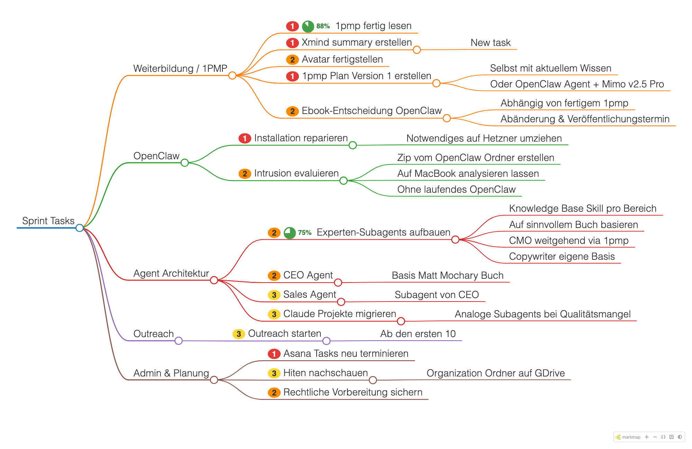

# Sprint Mindmap

Task mindmap for sprint planning. One markdown file drives both a **canvas editor** (XMind-style) and a **markmap** view for sharing and git diffs.



## Quick start

### Edit (canvas)

```bash
cd editor
npm ci          # import deps + test tooling (first time)
node server.mjs
```

Open [http://127.0.0.1:8731](http://127.0.0.1:8731). Edits autosave to a draft; **Save** (`Ctrl/Cmd+S`) writes `sprint-tasks.md` and refreshes the markmap HTML.

**Tests** (from repo root): `npm run setup` once, then `npm run test:all`. E2e auto-installs Chromium on first run.

See [editor/README.md](editor/README.md) for shortcuts and details.

### View (markmap)

```bash
open sprint-tasks.html
```

Or regenerate from markdown:

```bash
./render-markmap.sh
```

## Source of truth

`sprint-tasks.md` — heading-based outline with optional priority badges. German task names are plain text; no special encoding needed.

```markdown
## Branch name
### <span style="background:#e53935;color:#fff;...">1</span> Task title
- Detail bullet
```

## Priorities (5 levels)

| Level | Label | Color |
|-------|-------|-------|
| 1 | Critical | Red |
| 2 | High | Orange |
| 3 | Medium | Yellow |
| 4 | Low | Green |
| 5 | Lowest | Blue |

Set in the editor with **1…5** (clear: **0**) or the toolbar priority buttons. Saved badges render the same in markmap.

### Install as app (macOS)

```bash
cd editor && node server.mjs
```

Then in Chrome: **Install app** in the toolbar. In Safari: **File → Add to Dock…**. See [editor/README.md](editor/README.md).

## Files

| File | Purpose |
|------|---------|
| `sprint-tasks.md` | Task data (committed) |
| `sprint-tasks.html` | Read-only markmap (regenerated on Save) |
| `sprint-tasks.png` | Screenshot from `render-markmap.sh` |
| `editor/` | Canvas editor app |
| `render-markmap.sh` | Markdown → HTML + PNG |

## markmap options (frontmatter)

```yaml
---
markmap:
  colorFreezeLevel: 2
  initialExpandLevel: 4
  maxWidth: 340
---
```

## OpenClaw agents

Create mindmaps from any OpenClaw agent using the **create-mindmap** skill. Structure is modeled on [Agents365-ai/mermaid-skill](https://github.com/Agents365-ai/mermaid-skill); this skill targets heading-based markmap outlines (ebook summaries, sprint trees), not Mermaid flowcharts.

### One-time setup (Mac or Hetzner)

Clone this repo on each host:

```bash
git clone https://github.com/Julian7133/sprint-mindmapper.git ~/Projects/sprint-mindmapper
```

Install the skill (workspace path varies — pick one):

```bash
openclaw skills install ~/Projects/sprint-mindmapper/openclaw-skills/create-mindmap
# or global: openclaw skills install --global ~/Projects/sprint-mindmapper/openclaw-skills/create-mindmap
# or from git: openclaw skills install git:Julian7133/sprint-mindmapper@main --path openclaw-skills/create-mindmap
```

Set the repo path in `~/.openclaw/openclaw.json`:

```json5
{
  skills: {
    entries: {
      "create-mindmap": {
        enabled: true,
        env: { SPRINT_MINDMAP_REPO: "/home/you/Projects/sprint-mindmapper" },
      },
    },
  },
}
```

Use your actual clone path (`~/Projects/sprint-mindmapper` on Mac, `/home/you/...` on Hetzner).

### Invoke

- Slash command: `/create-mindmap`
- Or natural language: *"Create a mindmap from this ebook summary to `/path/out/`"*

The agent writes a `.md` file (any absolute path), validates it, then runs `render-markmap.sh` to produce `.html` (+ `.png` on macOS when Chrome is available).

### Ebook summary example

Source: `/tmp/openclaw-summary.txt` → output dir: `/Users/me/mindmaps/openclaw/`

The agent produces `/Users/me/mindmaps/openclaw/openclaw-ebook-summary.md`, validates with `editor/test-roundtrip.mjs`, renders to `.html`, and reports all output paths.

### Sandbox note

If the agent cannot write outside its workspace, save the mindmap inside the workspace or adjust OpenClaw sandbox settings.

Skill files: [`openclaw-skills/create-mindmap/`](openclaw-skills/create-mindmap/)
