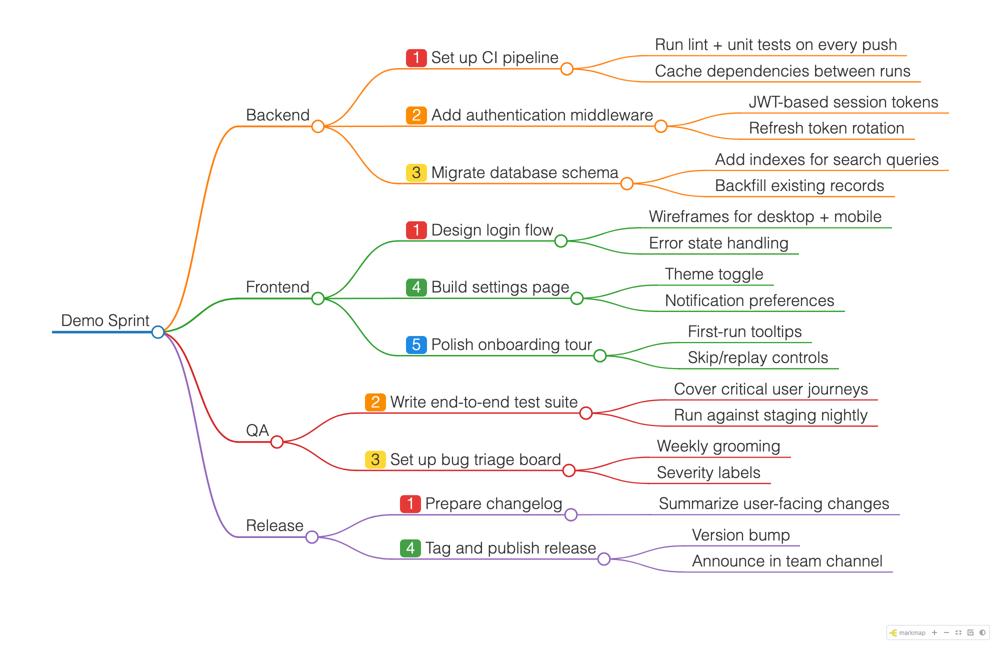

# Sprint Mindmap

Task mindmap for sprint planning. One markdown file drives both a **canvas editor** (XMind-style, shipped as the **AuraMindmap Chrome extension**) and a **markmap** view for sharing and git diffs.



## Quick start — install the Chrome extension

AuraMindmap isn't published on the Chrome Web Store yet, so install it unpacked from source:

```bash
cd extension
npm ci          # install deps (first time)
npm run build   # bundles the in-browser markmap renderer + assets
```

Then in Chrome:

1. Go to `chrome://extensions`
2. Enable **Developer mode** (top-right toggle)
3. Click **Load unpacked** and select the `extension/` folder
4. Pin the AuraMindmap icon, then click it (or `Ctrl/Cmd+Shift+M`) to open the editor in its own window

The extension works fully offline — no Node server required. It saves `.md` mindmaps via the browser's File System Access API (pick a folder, edits autosave to a draft, **Save** writes the file and re-renders the markmap inline). Optional Google Drive sync is available via `chrome.identity` but off by default.

See [extension/store-listing/SUBMISSION.md](extension/store-listing/SUBMISSION.md) for packaging/store-submission notes and [Agents.md](Agents.md) for architecture details.

### View (markmap)

```bash
open sprint-tasks.html
```

Or regenerate from markdown:

```bash
./render-markmap.sh
```

## Source of truth

`sprint-tasks.md` — heading-based outline with optional priority badges.

```markdown
## Branch name
### <span style="background:#e53935;color:#fff;...">1</span> Task title
- Detail bullet
```

## Priorities (5 levels)

| Level | Label | Color |
|-------|-------|-------|
| 1 | Critical | Red |
| 2 | High | Orange |
| 3 | Medium | Yellow |
| 4 | Low | Green |
| 5 | Lowest | Blue |

Set in the editor with **1…5** (clear: **0**) or the toolbar priority buttons. Saved badges render the same in markmap.

## Files

| File | Purpose |
|------|---------|
| `sprint-tasks.md` | Task data (committed) |
| `sprint-tasks.html` | Read-only markmap (regenerated on Save) |
| `docs/demo-sprint-tasks.md` | Sample data used to generate the README screenshot |
| `extension/` | Chrome extension (AuraMindmap) — primary editor |
| `editor/` | Standalone canvas editor app (Node-server PWA, source for the extension — see [editor/README.md](editor/README.md) for contributor setup) |
| `render-markmap.sh` | Markdown → HTML + PNG |

## markmap options (frontmatter)

```yaml
---
markmap:
  colorFreezeLevel: 2
  initialExpandLevel: 4
  maxWidth: 340
---
```

## OpenClaw agents

Generate mindmaps from any OpenClaw agent via the **create-mindmap** skill — setup, invocation, and examples are in [openclaw-skills/README.md](openclaw-skills/README.md).
